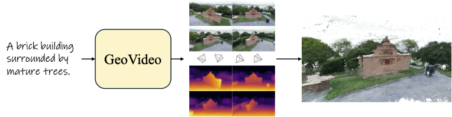

# GeoVideo: Introducing Geometric Regularization into Video Generation Models

GeoVideo introduces geometric regularization losses into video generation by augmenting latent diffusion models with per-frame depth prediction.
We adopt depth as the geometric representation due to recent advances in depth estimation and its strong compatibility with image-based latent encoders. To enforce structural consistency across time, we propose a multi-view geometric loss that aligns predicted depth maps across video frames.



## Environment Setup

To create a Python virtual environment named geovideo under the ./envs directory and install all dependencies from requirements.txt, run:

```bash
python3 -m venv ./envs/geovideo
source ./envs/geovideo/bin/activate
pip install -r requirements.txt
````

## Checkpoint Preparation

### Base Model Checkpoints (Except Transformer)

Download all checkpoints except the transformer from [here](https://huggingface.co/zai-org/CogVideoX1.5-5B/) and place them under:

./checkpoints/CogVideoX1.5-5B


### GeoVideo Transformer Checkpoint

Download our [transformer](https://huggingface.co/yunpeng1998/geovideo) checkpoint and place it under:

./checkpoints/transformer


## Running the Demo

Run the following command to generate videos:

```bash
python depth_demo.py --prompts_path ./prompts.txt --output_path ./outputs --model_path ./checkpoints/CogVideoX1.5-5B --sft_path ./checkpoints
```

## Results

<table>
  <tr>
    <td><video src="./assets/00001.mp4" controls width="320"></video></td>
    <td><video src="./assets/00001_depth.mp4" controls width="320"></video></td>
  </tr>
  <tr>
    <td><video src="./assets/00002.mp4" controls width="320"></video></td>
    <td><video src="./assets/00002_depth.mp4" controls width="320"></video></td>
  </tr>
</table>

## Citation

```bibtex
@article{bai2025geovideo,
  title={Geovideo: Introducing geometric regularization into video generation model},
  author={Bai, Yunpeng and Fang, Shaoheng and Yu, Chaohui and Wang, Fan and Huang, Qixing},
  journal={arXiv preprint arXiv:2512.03453},
  year={2025}
}
```


